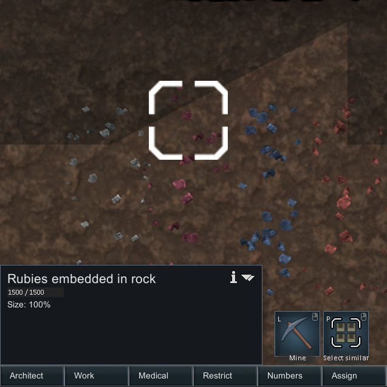
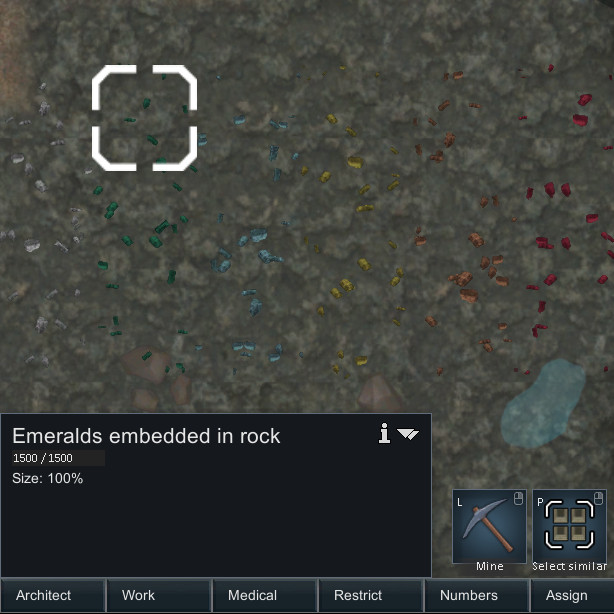

## Minerals: A rimworld mod for the [Hardcore SK project](https://github.com/skyarkhangel/Hardcore-SK)


This mod is an expansion of the Minerals Mod and the Minerals mod must come before in the loading order.

## Static minerals

These are randomly spawned when a map is created and are never respawned in a given map.


### Citrine

Crystals of silicon dioxide. Impurities of iron make these crystals a beautiful yellow. Rarely found. Yields glass batch when mined. Often yields gem-quality pieces due to its interesting color.


### Prasiolite

A very rare and beautiful green variety of quartz, silicon dioxide. Yields glass batch when mined. Often yields gem-quality pieces due to its interesting color.


### Pyrite

Crystals of iron(II) disulfide. A common mineral found underground and often mistaken for gold or silver by the foolish. Interesting, but not otherwise very useful. Yields rubble if mined.


### Large sulfur 

Elemental sulfur crystals formed by volcanic gasses. These ones are quite large and the geologic conditions that created them have ceased long ago.


### Corundum group

Crystals of aluminium oxide embedded in rock. One of the hardest minerals and often cut into gems.




### Beryl group

Crystals of beryl, a type of beryllium aluminium silicate, a rare mineral often used for gemstones.




### Azurite 

Deposits of copper carbonate hydroxide, occasionally used for gemstones. Often found near eachother, copper ore, calcite, and limestone rock.


## Installation

You can download the current development version by clicking the green "clone or download" button near the top of this page. You can also download specific "stable" releases [here](https://github.com/zachary-foster/MineralsExtra/releases), although they will probably not be updated too often. Once you have downloaded the mod, uncompress the file and up the folder in the `Mods` folder of you rimworld installation.

## To xml modders and potential contributers:

This mod is set up so that new minerals, both static and dynamic, can be added and configured using only XML changes.
Adding:

```
<ThingDef ParentName="StaticMineralBase">
		<defName>MyNewMineral</defName>
    ...
</ThingDef>
```

or

```
<ThingDef ParentName="DynamicMineralBase">
		<defName>MyNewMineral</defName>
    ...
</ThingDef>
```

to an XML file in `Defs/ThingDefs_Minerals` will cause a new mineral to be added to the game.

To add a mineral: 

* Copy the `ThingDef` for an existing mineral that is most similar to the one you want to make. Modify the XML how you want and add it to an XML file in `Defs/ThingDefs_Minerals`. Make sure to change the `defName`.
* Create textures for the new mineral and add to them to `Textures/Things/Mineral` in the same format as the others there.
* If you want to have you changes added to this mod for others to use, consider [forking](https://help.github.com/articles/fork-a-repo/) this repository and submitting a [pull request](https://help.github.com/articles/about-pull-requests/). I welcome contributions!
