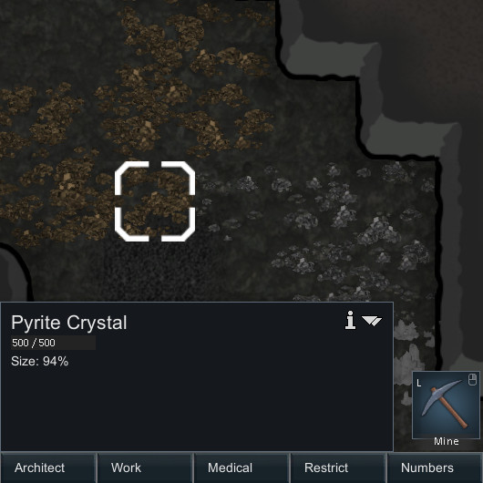
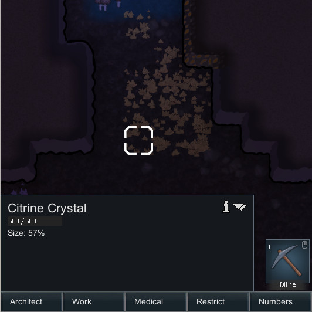
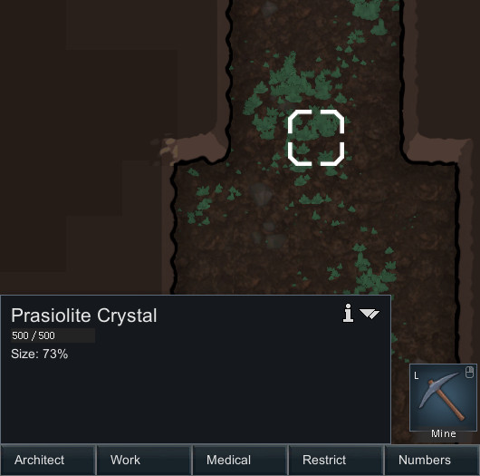
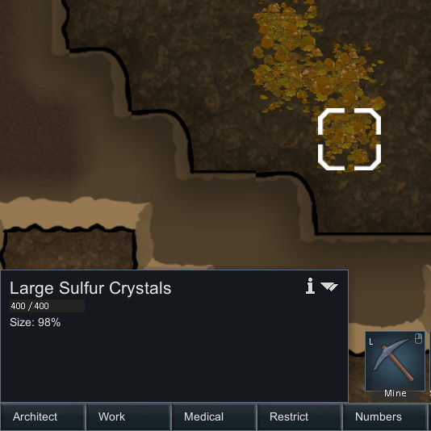
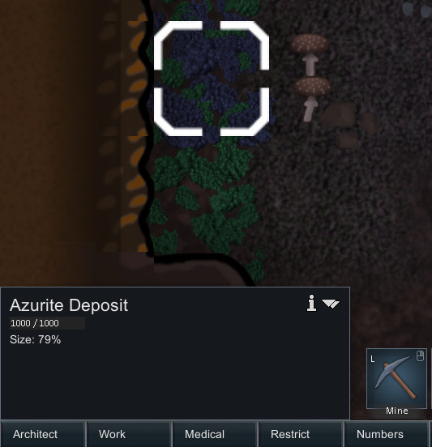

Minerals: A rimworld mod for the [Hardcore SK project](https://github.com/skyarkhangel/Hardcore-SK)
---------------------------------------------------------------------------------------------------

**This mod is an expansion of the "Minerals" Mod and the "Minerals" mod
be enabled and must come before in the loading order.**

Static minerals
---------------

These are randomly spawned when a map is created and are never respawned
in a given map.

### Pyrite Crystal

Crystals of iron(II) disulfide. A common mineral found underground and
often mistaken for gold or silver by the foolish. Interesting, but not
otherwise very useful. Yeilds rubble if mined.

**defName:** GoldPyriteCrystal

**Beauty:** 8

**Yields:** 10 CrushedStone

### Pyrite Crystal

Crystals of iron(II) disulfide. A common mineral found underground and
often mistaken for gold or silver by the foolish. Interesting, but not
otherwise very useful. Yeilds rubble if mined.

**defName:** SilverPyriteCrystal

**Beauty:** 8

**Yields:** 10 CrushedStone

### Citrine Crystal

Crystals of silicon dioxide. Impurities of iron make these crystals a
beautiful yellow. Rarely found. Yeilds glass batch when mined. Often
yeilds gem-quality peices due to its interesting color.

**defName:** CitrineCrystal

**Beauty:** 15

**Yields:** 15 GlassBatch

### Prasiolite Crystal

A very rare and beautiful green variety of quartz, silicon dioxide.
Yeilds glass batch when mined. Often yeilds gem-quality peices due to
its interesting color.

**defName:** PrasioliteCrystal

**Beauty:** 20

**Yields:** 15 GlassBatch

### Green Tourmaline Crystal

A rare type of tourmaline, a boron silicate mineral with many chemical
variations. This green variety often yeilds high quality gemstones.

**defName:** GreenTourmalineCrystal

**Beauty:** 25

**Yields:** 10 CrushedStone

### Siberite Crystal

A rare type of tourmaline, a boron silicate mineral with many chemical
variations. This purple variety often yeilds high quality gemstones.

**defName:** SiberiteCrystal

**Beauty:** 25

**Yields:** 10 CrushedStone

### Watermelon Tourmaline Crystal

A very rare type of tourmaline, a boron silicate mineral with many
chemical variations. This green and pink variety is prized for high
quality gemstones.

**defName:** WatermelonTourmalineCrystal

**Beauty:** 30

**Yields:** 10 CrushedStone

### Large Sulfur Crystals

Elemental sulfur crystals formed by volcanic gasses. These ones are
quite large and the geologic conditions that created them have ceased
long ago.

**defName:** BigSulfurCrystal

**Beauty:** 10

**Yields:** 30 Sulfur

### Corundum embedded in rock

Crystals of aluminium oxide embedded in rock. One of the hardest
minerals and often cut into gems. Impurities often color corundum, but
this patch is clear.

**defName:** CorundumCrystal

**Beauty:** 15

**Yields:** 5 CrushedStone

### Padparadschas embedded in rock

Crystals of aluminium oxide embedded in rock. One of the hardest
minerals and often cut into gems. This is a very rare and valuable
pink-orange variety.

**defName:** PadparadschaCrystal

**Beauty:** 15

**Yields:** 5 CrushedStone

### Aquamarine embedded in rock

Crystals of beryl, a type of beryllium aluminium silicate, a rare
mineral often used for gemstones. This variety is light blue due to
trace impurities of iron.

**defName:** AquamarineCrystal

**Beauty:** 15

**Yields:** 5 CrushedStone

### Heliodor embedded in rock

Crystals of beryl, a type of beryllium aluminium silicate, a rare
mineral often used for gemstones. This rare variety is yellow due to
trace impurities of iron.

**defName:** HeliodorCrystal

**Beauty:** 15

**Yields:** 5 CrushedStone

### Morganite embedded in rock

Crystals of beryl, a type of beryllium aluminium silicate, a rare
mineral often used for gemstones. This rare variety is pink due to trace
impurities of manganese.

**defName:** MorganiteCrystal

**Beauty:** 15

**Yields:** 5 CrushedStone

### Bixbite embedded in rock

Crystals of beryl, a type of beryllium aluminium silicate, a rare
mineral often used for gemstones. This very rare variety is a deep red
due to impurities of manganese. Unlike most types of beryl, this can be
found in igneous rocks.

**defName:** BixbiteCrystal

**Beauty:** 15

**Yields:** 5 CrushedStone

### Azurite Deposit

Beautiful blue deposits of copper carbonate hydroxide, occasionally used
for gemstones. Often found near copper ore, azurite, calcite, and
limestone rock.

**defName:** AzuriteDeposit

**Beauty:** 20

**Yields:** 10 CrushedStone

Installation
------------

You can download the current development version by clicking the green
"clone or download" button near the top of this page. You can also
download specific "stable" releases
[here](https://github.com/zachary-foster/MineralsExtra/releases),
although they will probably not be updated too often. Once you have
downloaded the mod, uncompress the file and up the folder in the `Mods`
folder of you rimworld installation.

To xml modders and potential contributers:
------------------------------------------

This mod is set up so that new minerals, both static and dynamic, can be
added and configured using only XML changes. Adding:

    <ThingDef ParentName="StaticMineralBase">
            <defName>MyNewMineral</defName>
        ...
    </ThingDef>

or

    <ThingDef ParentName="DynamicMineralBase">
            <defName>MyNewMineral</defName>
        ...
    </ThingDef>

to an XML file in `Defs/ThingDefs_Minerals` will cause a new mineral to
be added to the game.

To add a mineral:

-   Copy the `ThingDef` for an existing mineral that is most similar to
    the one you want to make. Modify the XML how you want and add it to
    an XML file in `Defs/ThingDefs_Minerals`. Make sure to change the
    `defName`.
-   Create textures for the new mineral and add to them to
    `Textures/Things/Mineral` in the same format as the others there.
-   If you want to have you changes added to this mod for others to use,
    consider [forking](https://help.github.com/articles/fork-a-repo/)
    this repository and submitting a [pull
    request](https://help.github.com/articles/about-pull-requests/). I
    welcome contributions!

Ideas for future work
---------------------

### Mineral types

#### Sand dunes

Appear near sand and grow when windy, shrink otherwise.

#### Ash drifts

Appear near burnt things and grow when windy, shrink otherwise.

#### Fossils

Appear in sedimentary rocks. Can be used as gemstones.

### Events

#### Volcanic ash fall

"A nearby volcano has erupted and is raining down hot ash over this
region. Watch out for fires."

For 2-5 days, light drops to 60% and drifts of ash slowly accumulate,
slowing travel. There is a grey filter effect. Fires randomly start.
Only occurs when within 3 map tiles from a volcanic area (optional?).
Lasts 2-5 days.

#### Haboob

"A giant dust cloud is heading this way! Best take cover."

Only occurs in dry biomes (chance based on precip of map tile). Starts
at one edge of the map and moves a little faster than most pawns can.
Movement is slow and almost no visability. Drifts of sand slowy
accumulate. Pawns not under roofs have a chance to develop asthma. Lasts
0.5 to 1 days.
